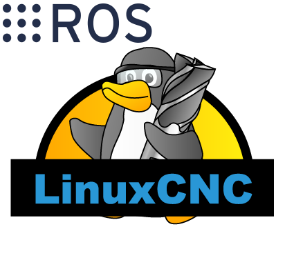

<p align="center">
  <a href="https://gitea.io/">
      

  </a>
</p>
<h1 align="center">ROS + LinuxCNC HAL</h1>

Hal-core is a lightweight HAL environment from LinuxCNC.
The installed size is approx 7Mib

### A hal environment can be used as platform to run realtime applications like:

	Motion controllers 
	Robots
	CNC-machines 
	Parport, EtherCAT applications
	Research and development 
	Scientific projects

### Install hal-core:

	$ git clone --recursive https://github.com/jjrbfi/hal-core.git /opt/hal-core
	$ cd /op/hal-core/
	$ sudo ./make
	
### Before run:
1. Modify **config/hal.yaml** file with your Hardware configuration and then run **hal_config.py** to create our .xml
2. Run ROScore and keep it in the backgroundwith: ```roscore &```


### To run:

	Setup HAL
	$ ./runtest
	
	Run ROS listener
	$ halcmd -r
	
	
### Requirements:
```bash
apt-get install -y build-essential 
apt-get install -y libudev-dev
apt-get install -y libboost-all-dev
apt-get install -y libreadline-dev 
```
